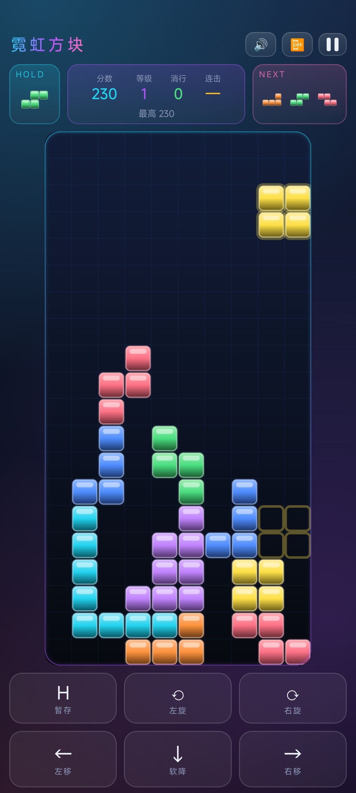

# 霓虹方块 · Neon Tetris

一套完整实现的现代俄罗斯方块，两种形态：

| | 技术栈 | 说明 |
|---|---|---|
| **网页版** | 单文件 HTML + Canvas | [`index.html`](index.html)，零依赖零构建，双击即玩 |
| **安卓原生版** | Kotlin + Jetpack Compose | [`android/`](android/)，完全原生重写，可编译出 APK |

两版共用同一套规则设计（SRS 旋转、T-spin、Back-to-Back），但代码各自独立。



## 玩法特性

- **SRS 旋转 + 踢墙**：I 块与 JLSTZ 各自独立的踢墙表，贴墙贴地都能转进去
- **7-bag 随机**：每七个方块为一袋打乱，不会连续来一堆 S/Z
- **Hold 暂存**：每个方块可暂存一次
- **幽灵落点**：半透明轮廓预告落点
- **T-spin 判定**：三角规则，单/双/三消分别 800/1200/1600 分
- **Back-to-Back**：连续打出 Tetris 或 T-spin 得 1.5 倍分
- **锁定延迟**：落地后 500ms 内仍可微调
- **等级加速**：每消 10 行升一级，共 15 档下落速度
- **DAS/ARR 连发**：长按方向先延迟 150ms 再以 38ms 间隔连发

## 网页版

直接用浏览器打开 [`index.html`](index.html)，不需要安装任何东西。

如果启用 GitHub Pages，`https://<用户名>.github.io/<仓库名>/` 就能直接在线玩。

| 按键 | 作用 |
|---|---|
| `←` `→` | 左右移动 |
| `↓` | 软降 |
| `↑` / `X` | 顺时针旋转 |
| `Z` | 逆时针旋转 |
| `空格` | 硬降 |
| `C` | 暂存 |
| `P` | 暂停 |
| `R` | 重开 |

手机上会自动出现触屏按键，棋盘上也支持手势（轻点旋转、左右拖动横移、下滑硬降）。

## 安卓原生版

详见 [`android/README.md`](android/README.md)。

```bash
cd android
./gradlew assembleDebug        # 产物在 app/build/outputs/apk/debug/
./gradlew installDebug         # 连上手机直接装
./gradlew testDebugUnitTest    # 31 个规则回归测试
```

要求 JDK 17+、Android SDK Platform 34、Build-Tools 34.0.0。
SDK 路径写在 `android/local.properties`（机器相关，未纳入版本控制）。

## 项目结构

```
.
├── index.html              # 网页版（单文件，含全部 CSS/JS）
├── README.md
├── LICENSE
└── android/                # 安卓原生版
    ├── app/src/main/java/com/neon/tetris/
    │   ├── game/           # 纯 Kotlin 规则内核，无 Android 依赖
    │   ├── ui/             # Jetpack Compose 界面与 Canvas 渲染
    │   ├── Sfx.kt          # 波形合成音效（无音频资源文件）
    │   └── MainActivity.kt
    ├── app/src/test/       # 31 个单元测试
    └── screenshots/
```

## 关于测试

安卓版把游戏规则做成不依赖任何 Android API 的纯 Kotlin 类，所以全部规则都能在 JVM 上
以毫秒级跑完，不需要模拟器：

```
GameEngineTest       22 个   随机器 / SRS 踢墙 / 消行计分 / T-spin / 锁定延迟 …
GamePresenterTest     9 个   帧循环与状态同步（含一个真机才暴露的 bug 的回归）
```

## License

[MIT](LICENSE)
